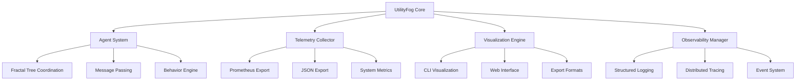

# UtilityFog-Fractal-TreeOpen Documentation

Welcome to the comprehensive documentation for **UtilityFog-Fractal-TreeOpen**, an advanced utility fog simulation system with fractal tree structures and comprehensive observability.

## 🚀 What is UtilityFog?

UtilityFog-Fractal-TreeOpen is a cutting-edge simulation platform that combines:

- **Advanced Agent Simulation**: Sophisticated multi-agent systems with emergent behaviors
- **Fractal Tree Structures**: Hierarchical organization patterns for scalable coordination
- **Comprehensive Observability**: Real-time monitoring, logging, and tracing capabilities
- **Interactive Visualization**: Multiple visualization modes including CLI and web interfaces

## ✨ Key Features

### 🔬 Phase 3 Capabilities

=== "Telemetry System"
    - **Real-time Metrics**: Counter, Gauge, and Histogram metrics
    - **Multiple Exports**: Prometheus and JSON format support
    - **System Integration**: Hooks for coordination, messaging, and health monitoring
    - **Thread-Safe Operations**: Concurrent access with proper locking

=== "CLI Visualization"
    - **ASCII Art Rendering**: Tree structures, message flows, state transitions
    - **Interactive Mode**: Real-time updates with keyboard navigation
    - **Multiple Exports**: HTML, SVG, Text, and JSON formats
    - **Demo Data**: Built-in sample data generation

=== "Observability"
    - **Structured Logging**: JSON-formatted logs with trace propagation
    - **Distributed Tracing**: Thread-local context management
    - **Rate-Limited Errors**: Intelligent error suppression
    - **Event System**: Structured event tracking with metadata

=== "Feature Flags"
    - **Centralized Config**: JSON configuration with validation
    - **Environment Overrides**: Runtime configuration with `UFOG_*` variables
    - **Dynamic Control**: Enable/disable features without restarts

### 🛠️ Development Experience

- **Comprehensive Makefile**: Complete development workflow
- **Quality Assurance**: Automated testing, linting, and type checking
- **High Test Coverage**: 75%+ telemetry, 94%+ observability, 100% feature flags
- **CI/CD Pipeline**: Automated quality gates and deployment

## 🎯 Quick Start

### Installation

```bash
# Install from release
pip install utilityfog-fractal-treeopen

# Or install from source
git clone https://github.com/Goldislops/UtilityFog-Fractal-TreeOpen.git
cd UtilityFog-Fractal-TreeOpen
make install
```

### Basic Usage

```bash
# Run simulation
utilityfog-sim --agents 10 --steps 100

# Interactive visualization
utilityfog-viz interactive --input simulation_data.json

# Generate telemetry
make telemetry

# Run observability demo
make observe
```

### Development Workflow

```bash
# Setup development environment
make install

# Run tests with coverage
make test && make coverage-html

# Quality checks
make lint && make format && make type-check

# Phase 3 component testing
make telemetry viz observe bench
```

## 📊 Architecture Overview



## 🔧 Configuration

### Feature Flags

Control system behavior with feature flags:

```json
{
  "telemetry": {
    "enabled": true,
    "collection_interval": 30.0,
    "export_format": "prometheus"
  },
  "visualization": {
    "enabled": true,
    "interactive_mode": true,
    "export_formats": ["html", "svg"]
  },
  "observability": {
    "enabled": true,
    "log_level": "INFO",
    "trace_sampling": 1.0
  }
}
```

### Environment Variables

Runtime configuration with environment variables:

```bash
# Telemetry control
export UFOG_ENABLE_TELEMETRY=true
export UFOG_TELEMETRY_INTERVAL=30

# Observability settings
export UFOG_OBSERVABILITY_LOG_LEVEL=DEBUG
export UFOG_TRACE_SAMPLING_RATE=0.1

# Visualization options
export UFOG_VIZ_INTERACTIVE=true
export UFOG_VIZ_EXPORT_FORMAT=html
```

## 📈 Monitoring & Observability

### Telemetry Dashboard

Monitor system performance with built-in telemetry:

- **Agent Metrics**: Population, behavior patterns, coordination efficiency
- **System Metrics**: CPU, memory, network utilization
- **Custom Metrics**: Application-specific measurements

### Structured Logging

All system events are logged in structured JSON format:

```json
{
  "timestamp": "2025-09-22T00:42:00Z",
  "level": "INFO",
  "message": "Agent coordination completed",
  "trace_id": "trace_abc123",
  "agent_id": 42,
  "coordination_time_ms": 15.3
}
```

### Distributed Tracing

Track operations across the entire system with trace propagation:

```python
from agent.observability import trace_operation

with trace_operation("agent_movement", agent_id=123) as trace_id:
    # All operations within this block are traced
    calculate_movement()
    update_position()
```

## 🚀 Production Deployment

### System Requirements

- **Python**: 3.8+ (recommended: 3.11+)
- **Memory**: 4GB+ RAM for typical simulations
- **CPU**: Multi-core recommended for parallel processing
- **Storage**: 1GB+ for logs and data

### Deployment Options

=== "Docker"
    ```bash
    # Build container
    docker build -t utilityfog:0.1.0-rc1 .
    
    # Run simulation
    docker run -p 8000:8000 utilityfog:0.1.0-rc1
    ```

=== "Kubernetes"
    ```yaml
    apiVersion: apps/v1
    kind: Deployment
    metadata:
      name: utilityfog
    spec:
      replicas: 3
      selector:
        matchLabels:
          app: utilityfog
      template:
        metadata:
          labels:
            app: utilityfog
        spec:
          containers:
          - name: utilityfog
            image: ghcr.io/goldislops/utilityfog:0.1.0-rc1
            ports:
            - containerPort: 8000
    ```

=== "Systemd"
    ```ini
    [Unit]
    Description=UtilityFog Simulation Service
    After=network.target
    
    [Service]
    Type=simple
    User=utilityfog
    WorkingDirectory=/opt/utilityfog
    ExecStart=/opt/utilityfog/venv/bin/utilityfog-sim
    Restart=always
    
    [Install]
    WantedBy=multi-user.target
    ```

## 📚 Documentation Structure

This documentation is organized into several sections:

- **[Getting Started](getting-started/installation.md)**: Installation, configuration, and first steps
- **[Phase 3 Features](phase3/telemetry.md)**: Detailed guides for telemetry, visualization, and observability
- **[Development](development/setup.md)**: Development setup, testing, and contribution guidelines
- **[API Reference](api/core.md)**: Complete API documentation
- **[Deployment](deployment/production.md)**: Production deployment and monitoring guides

## 🤝 Community & Support

- **GitHub Issues**: [Report bugs and request features](https://github.com/Goldislops/UtilityFog-Fractal-TreeOpen/issues)
- **Discussions**: [Community discussions and Q&A](https://github.com/Goldislops/UtilityFog-Fractal-TreeOpen/discussions)
- **Contributing**: See our [contribution guidelines](development/contributing.md)

## 📄 License

This project is licensed under the MIT License. See the [LICENSE](https://github.com/Goldislops/UtilityFog-Fractal-TreeOpen/blob/main/LICENSE) file for details.

---

**Ready to get started?** Check out our [installation guide](getting-started/installation.md) or jump into the [quick start tutorial](getting-started/quickstart.md)!
